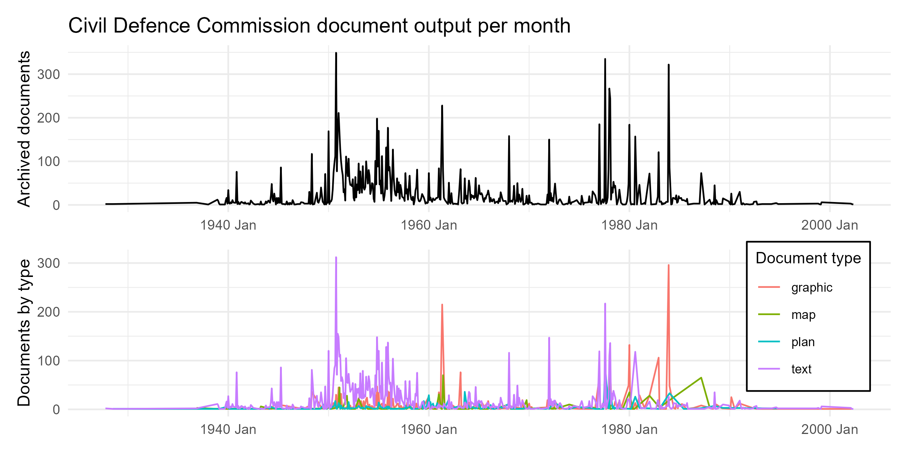

# Civil-Defense Commission Archive
*DATA | ETL*

This repository maps MELICA's progress in the creation of a thematic digital archive focused on the civil defense from the Civil Defense Commission's materials present in the Aarhus City Archive. This repository processes the digital archive metadata in order to gauge numbers and types of documents scanned and digitized in order to prioritize post-processing according to the project's themes.

* Temporal analysis of the content of the newly built digital archive :smile:

---

## Purpose
For analysis of Civil-Defense Commission archive metadata. 

---
## Authors
* Adela Sobotkova ]), MELICA project, adela@cas.au.dk

## License
CC-BY-SA 4.0, see attached License.md

## DOI
[Here will be DOI or some other identifier once we have it]

### References
[Here will go related articles or other sources we will publish/create]

---
# How to use this repository

## Sources and prerequisites
Archive document metadata comes from the spreadsheet maintained by the Aarhus City Archive staff digitizing and annotating the documents during 2024-2025. Circa 40 boxes of materials are represented.

### Data
Manual annotations for each document categorized as shelter, civil-defense or preparedness strategy in the Aarhus City Archive that was scanned as part of MELICA.

### Software
1. R 4.3.3

### Hardware
1. Multiple-screens
2. Mouse
3. Coffee

## Visuals

